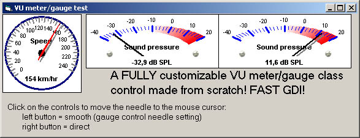



## VU meter/gauge class control

### Description

This class displays a fully customizable VU meter / gauge control (see screenshot). Needle animation included to make it move smoooooth (3 types). ALL parameters can be set and all objects of the gauge can be scaled (X and Y).

Nice example included.
 
### More Info
 

             |
---                |---
**Submitted On**   |2004-10-12 20:35:30
**By**             |[Alain van Hanegem](https://github.com/Planet-Source-Code/PSCIndex/blob/master/ByAuthor/alain-van-hanegem.md)
**Level**          |Advanced
**User Rating**    |5.0 (154 globes from 31 users)
**Compatibility**  |VB 5\.0, VB 6\.0, ASP \(Active Server Pages\) 
**Category**       |[Graphics](https://github.com/Planet-Source-Code/PSCIndex/blob/master/ByCategory/graphics__1-46.md)
**World**          |[Visual Basic](https://github.com/Planet-Source-Code/PSCIndex/blob/master/ByWorld/visual-basic.md)
**Archive File**   |[VU\_meter\_g18044310122004\.zip](https://github.com/Planet-Source-Code/alain-van-hanegem-vu-meter-gauge-class-control__1-56702/archive/master.zip)

